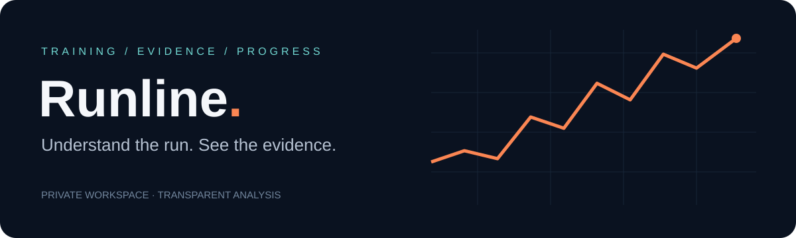

<p align="center"></p>

<p align="center"><strong>Your running history, with explanations you can inspect.</strong><br/>React · TypeScript · Cloudflare Workers · D1 · R2 · Tesseract</p>

Runline brings activities, recovery check-ins and race scenarios into one private workspace. Paste a Strava link, review a screenshot extraction, import a GPS file, or read your running summaries from Intervals.icu. Every finding shows its inputs and acknowledges missing information.

## What you can do

| Workflow | What happens |
|---|---|
| **Read a Strava link** | Resolves supported share links and reads public title, date and labelled measurements. Login walls return metadata only. Review before saving. |
| **Import a screenshot** | English OCR runs in the browser. Edit the extracted numbers before saving a private attachment. |
| **Connect Intervals.icu** | Read-only import of up to 180 days / 500 running summaries. The API key is used transiently and never stored. |
| **Understand a session** | Compare similar-distance runs with the same time basis; examine pacing changes and incomplete splits. |
| **Review training** | Inspect rolling weekly volume, recent check-ins and resting-heart-rate context when enough observations exist. |
| **Explore race scenarios** | Riegel equivalents with visible assumptions. These are formula scenarios, not calibrated predictions. |
| **Keep control** | Owner-scoped records, private screenshots, editable imports and JSON export. |

## Intelligence with an audit trail

The current engine is deterministic TypeScript, **not an LLM or a trained ML model**. It selects evidence relevant to a question, runs calculations and returns observations, context and missing-data notices. It does not invent heart-rate zones, injury risk, readiness scores or a marathon prediction from a single tempo run.

- Weekly comparisons never divide by an empty previous week.
- Historical session analysis excludes future activities.
- Pace comparisons require at least two prior runs within 10% distance and matching moving/elapsed time basis.
- Split analysis compares equal groups of full kilometres and identifies incomplete coverage.
- Recovery context includes the age and number of observations behind it.

See [analysis methods](docs/METHODS.md), [architecture](docs/ARCHITECTURE.md) and [security](SECURITY.md).

## Development

Requires Node 22.13+ and pnpm 11.25.0. The lockfile pins dependencies.

```sh
corepack enable
pnpm install --frozen-lockfile
pnpm run test
pnpm run typecheck
pnpm run prepare:ocr
pnpm run dev
```

The development server uses port 5173. `pnpm run build` creates the Worker build. OCR assets are generated from installed Tesseract packages and a checksum-verified English model; they are excluded from the public source snapshot.

**Hosting:** this application uses Sites authenticated identity forwarding plus Cloudflare D1 (`DB`) and R2 (`BUCKET`). The public source contains no deployment ID. Local UI and pure-function tests work independently; persisted authenticated workflows require those platform bindings. Before hosting elsewhere, replace `app/chatgpt-auth.ts` with verified authentication and configure migrations/bindings. Never expose a raw Worker that trusts user-supplied identity headers.

## Validation

Nineteen regression tests cover calculations, screenshot text parsing, training-history comparisons, login-wall handling, URL allowlists, redirects, unit conversion and fetch denial. TypeScript and the production build are also checked locally. CI repeats tests and typechecking.

Live Intervals.icu credentials, browser interaction and WebMCP runtime behavior have not been tested end to end. Strava markup can change; a successful public read is not guaranteed. Imports always remain editable.

## Current boundaries

Direct Strava OAuth, FIT parsing, full-resolution streams, wellness sync, calibrated forecasting and an LLM coach are not implemented. GPX/TCX imports assume one continuous activity, use elapsed time and approximate GPS distance; review pauses and multi-segment files. Deleting a run currently retains its uploaded attachments, as explained in the app confirmation.

The repository includes fictional examples only. The deployed personal workspace remains private; public source access does not grant access to running records.

## Project map

```text
app/                 Workspace UI and authenticated API routes
lib/intelligence.ts  Evidence selection and history comparisons
lib/strava-link.ts   Bounded public-page reader and URL validation
lib/running.ts       Activity parsing and race calculations
db/                  Schema and migrations
tests/               Deterministic regression tests
docs/                Architecture and analysis methods
```

## Third-party work

Tesseract.js, Tesseract core and English trained data retain their upstream licences; see `public/ocr/LICENSE.txt`. Runline is an independent project and is not affiliated with Strava or Intervals.icu.
