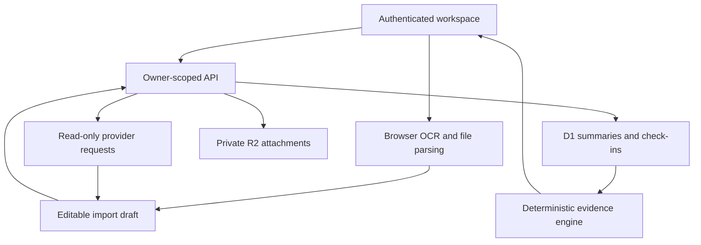

# Architecture

The React workspace calls authenticated route handlers. Sites supplies trusted user identity at its edge. Each database query uses that identity, never an owner ID supplied by the client. D1 stores activity summaries, goals and recovery check-ins. R2 stores private uploaded screenshots.

`POST /api/strava-preview` reads a bounded public page and returns an unsaved draft. No provider account credentials are used. Intervals.icu import accepts a key for one read-only request and discards it afterward. API keys must never be included in logs, URLs, analytics or stored records.

The evidence engine runs on normalized summaries. It returns structured findings with evidence labels and missing-data messages. There is no model call, agent loop or training pipeline. The optional WebMCP tool exposes a read-only workspace summary when the browser supports it.

## Portability

The Site instance ID is intentionally absent from the public snapshot. D1 and R2 bindings and the trusted authentication edge are deployment prerequisites. A separate host needs its own verified session integration. The header adapter alone is not a standalone authentication system.

## Future extensions

Provider OAuth, full streams, calibrated prediction evaluation and a constrained language-model explanation layer are reasonable next steps. Each needs independent validation and explicit provenance. An LLM should explain computed evidence, not manufacture measurements or silently write a training plan.
